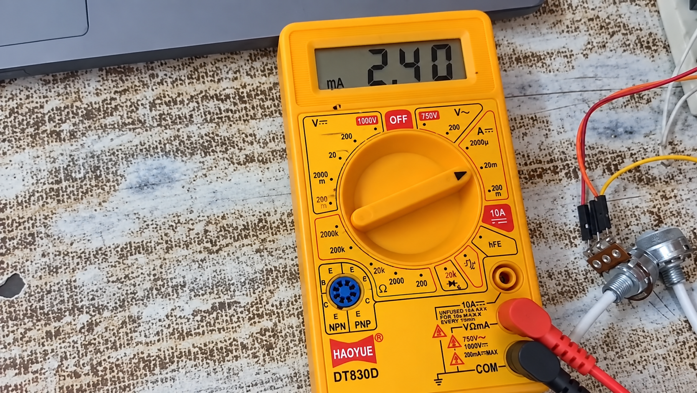
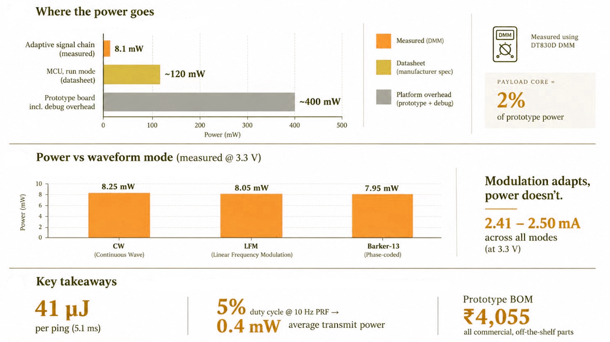
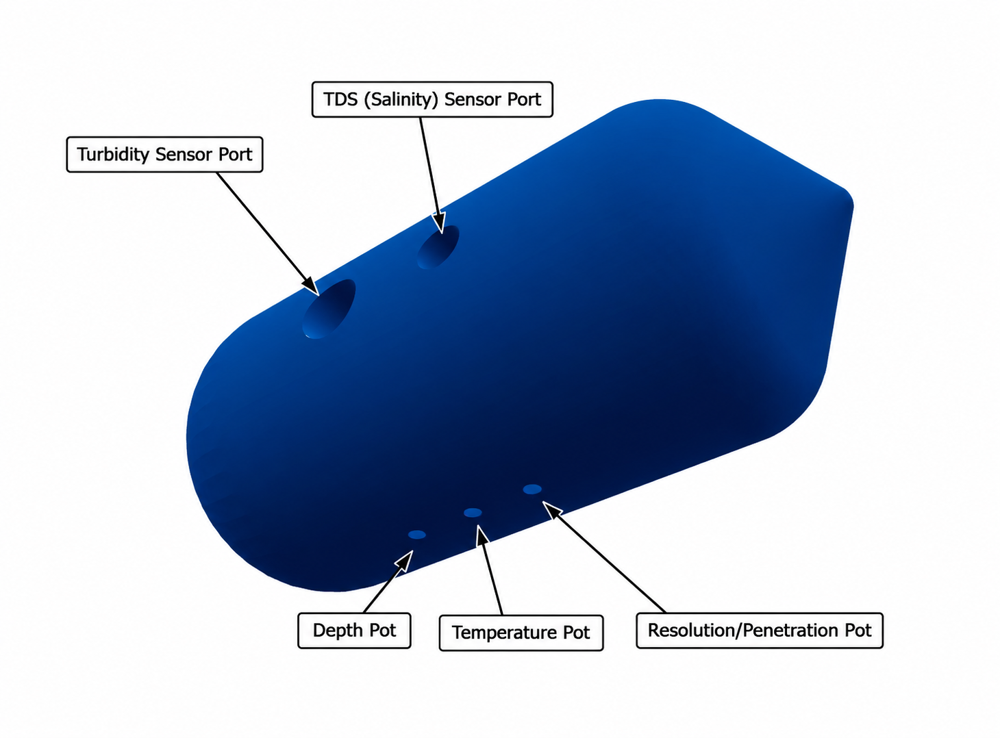

# KESTREL — Adaptive Software-Defined Sonar Transmitter Payload for AUVs

**Smart India Hackathon 2026 — Problem Statement SIH26058**

[](https://www.st.com/)
[](https://vitejs.dev/)
[](https://reactjs.org/)
[](https://www.typescriptlang.org/)
[](https://developer.mozilla.org/en-US/docs/Web/API/Web_Serial_API)
[](LICENSE)

| Team | Team ID | Institution |
|---|---|---|
| **KESTREL** | **127602** | SRM Institute of Science and Technology, Ramapuram |

> **Live Dashboard:** [aquachirp-sonar-transmitter.vercel.app](https://aquachirp-sonar-transmitter.vercel.app/)

---

## Hardware and Prototype Snapshot

**Measured on Rigol DS1054Z**

| Barker-13 | CW Signal | LFM Chirp |
| :---: | :---: | :---: |
|  |  |  |

| Embedded Core | DAC | Physical Validation | Mechanical Integration |
|---|---|---|---|
| STM32F103RBT6 | MCP4921 12-bit | Rigol DS1054Z | AUV 3D CAD |

---

## Problem Statement

Conventional sonar transmitters are designed around fixed transmission parameters, making them inflexible when underwater environmental conditions change.

For an AUV operating in varying conditions, parameters such as depth, temperature, turbidity, salinity and the required balance between resolution and penetration can influence the choice of transmission strategy.

SIH26058 calls for a **software-defined, low-power and real-time adaptive sonar transmitter payload** capable of generating configurable waveforms and adapting its transmission parameters according to environmental conditions.

---

## Solution

KESTREL is a software-defined sonar transmitter payload built around an STM32 microcontroller and a configurable analog signal chain. The system continuously processes environmental inputs and selects an appropriate transmission strategy. The selected waveform is generated digitally, streamed through the DAC using hardware-timed data transfer, reconstructed through the analog signal chain, and validated using an oscilloscope.

**Core Pipeline: Sense — Adapt — Synthesize — Convert — Filter — Validate**

| PS Requirement | KESTREL Implementation |
|---|---|
| Software-defined transmitter | STM32-based firmware-controlled waveform generation |
| Real-time adaptation | Environmental inputs drive transmission-strategy selection |
| Multiple waveform types | CW, LFM Chirp, Geometric Sweep and Barker-13 phase coding |
| Low-power operation | Timer + DMA used for waveform sample streaming |
| Digital waveform synthesis | Firmware-generated waveform samples with LUT-based DDS |
| Analog transmission chain | MCP4921 DAC, CD4053B analog MUX, MCP6004 active filters |
| Real-time environmental inputs | Temperature, Turbidity, Salinity/TDS, Depth, Resolution-Penetration preference |
| Waveform validation | Rigol DS1054Z time-domain and FFT measurements |
| AUV payload integration | Compact 3D-designed streamlined payload enclosure |

---

## Repository Structure

```text
SIH26058-Team-Kestrel/
|
|-- firmware/                          STM32 Edge Firmware
|   +-- AquaChirp_...TELEMETRY.c       Adaptive DMA waveform engine (1556 lines)
|
|-- hardware/                          Physical Circuits and Interfaces
|   +-- Wiring Guide.md                Master pin-to-pin wiring reference
|
|-- mechanical/                        3D AUV Payload Concept
|   +-- cad/
|       |-- AUV_payload_streamlined.stl   230 mm x 100 mm hydrodynamic hull
|       |-- AUV_service_panel.stl         120 mm quick-access hatch
|       +-- AUV_hinge_pin.stl            3.4 mm diameter pivot dowel
|
|-- docs/                              Engineering Documentation
|   +-- Architecture.md                Complete system architecture flow
|
|-- src/                               Live Web DSP Telemetry Dashboard
|   |-- components/                     Oscilloscope, Waterfall, Radar, Decision views
|   |-- utils/                          Acoustic decision engine, signal generator
|   +-- App.tsx                         Main application with WebSerial integration
|
|-- README.md                          This file
|-- package.json                       Web dashboard dependencies
+-- vite.config.ts                     Build configuration
```

---

## System Architecture

```text
             ENVIRONMENTAL INPUTS
    +-------------------------------------+
    | Depth | Temperature | Turbidity     |
    | Salinity | Resolution-Penetration   |
    +------------------+------------------+
                       |
                       v
    +------------------+------------------+
    |          STM32F103RBT6              |
    |                                     |
    |  Sensor Acquisition (ADC1/ADC2)     |
    |  Adaptive Decision Engine           |
    |  DDS Waveform Synthesis (LUT)       |
    |  DMA Circular Buffer Streaming      |
    +------------------+------------------+
                       |
                Timer + DMA
                       |
              +--------+--------+
              |                 |
              v                 v
    +---------+-------+  +------+----------+
    | MCP4921 DAC     |  | USART2 TX       |
    | 12-bit SPI      |  | 115200 baud     |
    +--------+--------+  | JSON Telemetry  |
             |            +------+----------+
             v                   |
    +--------+--------+         v
    | Analog Signal   |  +------+----------+
    | Chain            |  | Web Dashboard   |
    |                 |  | WebSerial API   |
    | RC Filter       |  | React + Vite    |
    | CD4053B MUX     |  +-----------------+
    | MCP6004 Buffer  |
    +--------+--------+
             |
             v
      ANALOG OUTPUT
             |
    +--------+--------+
    | Rigol DS1054Z   |
    | Time + FFT      |
    +-----------------+
```

---

## Signal Flow

```text
Environmental Inputs
        |
STM32 ADC Data Acquisition
        |
Adaptive Transmission Logic
        |
Waveform Synthesis (Phase Accumulator + LUT)
        |
Timer + DMA Sample Streaming
        |
MCP4921 12-bit DAC
        |
Analog Reconstruction Filter
        |
CD4053B Filter Selection (PB5 controlled)
        |
MCP6004 Buffer / Conditioning
        |
Analog Output
        |
Oscilloscope Validation (Time Domain + FFT)
```

---

## Adaptive Modulation Rules

The decision engine selects waveform modulation based on environmental state:

| Condition | Selected Modulation | Rationale |
|---|---|---|
| Depth > 80 m | Barker-13 (BPSK) | 11.1 dB pulse compression gain for deep-water clutter rejection |
| Turbidity < 30 NTU and Depth < 30 m | CW (Continuous Wave) | Narrowband Doppler estimation in clean shallow water |
| Turbidity > 60 NTU | LFM Chirp | Pulse compression through suspended particulate scattering |
| Turbidity 30-60 NTU | Geometric Sweep | Doppler-tolerant wideband energy for moderate scattering |
| Default fallback | Barker-13 | Standard phase coding for reliable SNR compression |

Window function selection follows SNR estimation:

| Condition | Window | Sidelobe Rejection |
|---|---|---|
| CW mode or SNR > 15 dB | Hamming | -43 dB |
| SNR 7-15 dB | Hann | -31 dB |
| SNR < 7 dB | Blackman | -58 dB |

---

## STM32 Pin Map

| Pin | Peripheral | Connection | Function |
|---|---|---|---|
| PA0 / A0 | ADC1_IN0 | Potentiometer 1 | Resolution / Penetration preference (0.0 - 1.0) |
| PA1 / A1 | ADC1_IN1 | Potentiometer 2 | Turbidity (SEN0189 / 10k-22k divider) |
| PA4 / A2 | ADC1_IN4 | Potentiometer 3 | Temperature (5 - 35 deg C) |
| PB0 / A3 | ADC1_IN8 | Potentiometer 4 | Depth / Water Level (0 - 200 m) |
| PC0 / A5 | ADC1_IN10 | Potentiometer 5 | Salinity / TDS (0 - 40 PSU) |
| PA6 / D12 | TIM3_CH1 | PWM Output | Waveform DMA output at 100 kSPS (ARR = 639) |
| PC1 / A4 | ADC2_IN11 | Self-Monitor | Final waveform loopback (64-sample feedback) |
| PB5 / D4 | GPIO Output | CD4053B Select | Dynamic filter capacitor selection |
| PA2 / D1 | USART2 TX | ST-LINK VCP | JSON telemetry at 115200 baud |
| PA3 / D0 | USART2 RX | ST-LINK VCP | Serial receive |
| PC13 | GPIO Output | User LED | DMA loop heartbeat indicator |

---

## Analog Signal Chain

```text
PA6 / D12 (TIM3_CH1 PWM)
       |
      1k ohm
       |
     FILT1 --------+---------- CD4053B Pin 14 (COM)
       |            |                  |
       |            |          +-------+-------+
       |            |        PB5=0           PB5=1
       |            |       100 nF           10 nF
       |            |         |                |
       |            |        GND              GND
       v            |
  MCP6004 Ch.A      |
  (Voltage Follower) |
       |            |
      1k ohm        |
       |            |
     FILT2 -------- 10 nF --- GND
       |
       v
  MCP6004 Ch.B
  (Voltage Follower)
       |
       v
  FINAL WAVE ------+---------- DSO / Transducer
                    |
                  10k ohm
                    |
                WAVE_MON
                    |
              +-----+-----+
              |            |
         PC1 / A4       1 nF
        (ADC2 Loopback)    |
                          GND
```

---

## Experimental Validation

### Oscilloscope Measurements

All waveforms were measured at the FINAL WAVE output node using a Rigol DS1054Z digital storage oscilloscope.

<!-- DSO images will be added here -->
<!-- CW, LFM Chirp, and Barker-13 waveform captures -->

### Power Measurement

The transmitter signal chain was measured at 3.3 V using a digital multimeter connected in series with the supply.




| Waveform Mode | Measured Power | Equivalent Current |
|---|---:|---:|
| CW | 8.25 mW | 2.50 mA |
| LFM Chirp | 8.05 mW | 2.44 mA |
| Barker-13 | 7.95 mW | 2.41 mA |

Across all tested waveform modes, the measured signal-chain power remained within **7.95 - 8.25 mW**, corresponding to approximately **2.41 - 2.50 mA at 3.3 V**.

> **Measurement scope:** These values represent the 3.3 V transmitter signal-chain section only and do not represent the total power consumption of the complete development-board system.

---

## AUV Mechanical Integration

A 3D CAD enclosure was developed to explore the mechanical integration of the transmitter electronics into an AUV payload module.



| Component | Dimensions | Description |
|---|---|---|
| Streamlined Hull | 230 mm x 100 mm diameter | Hydrodynamic cylindrical body of revolution |
| Service Panel | 120 mm x 80.6 mm arc | Quick-access hatch with conformal profile |
| Hinge Pin | 90.8 mm x 3.4 mm diameter | Cylindrical pivot dowel for panel articulation |

### Design Features

- Compact cylindrical form factor compatible with standard AUV payload bays
- Internal dry electronics cavity (62 - 92 mm inner diameter)
- Removable service panel with hinge mechanism for field access
- Rear cable pass-through provision
- Sensor and PCB mounting provisions
- Parabolic forebody profile for minimal hydrodynamic drag

> The current CAD represents a **prototype mechanical integration concept** and is not claimed as a pressure-rated or waterproof housing.

STL files are available in [`mechanical/cad/`](mechanical/cad/).

---

## Acoustic Physics

### Mackenzie Sound Speed Equation (1981)

```
c(T, S, D) = 1448.96 + 4.591T - 0.05304T^2 + 2.374e-4 T^3
            + 1.340(S - 35) + 1.630e-2 D + 1.675e-7 D^2
            - 1.025e-2 T(S - 35) - 7.139e-13 T D^3
```

Where T is temperature (deg C), S is salinity (PSU) and D is depth (m).

### Francois-Garrison Absorption Model

```
alpha(f) = A1*P1*(f1*f^2)/(f1^2 + f^2) + A2*P2*(f2*f^2)/(f2^2 + f^2) + A3*P3*f^2   [dB/km]
```

Accounts for Boric Acid relaxation, Magnesium Sulfate relaxation, and pure water viscous attenuation.

### Range Resolution and Pulse Compression

```
Delta_R = c / (2 * B)
G_p = 10 * log10(B * tau)   [dB]
```

---

## Serial Telemetry Protocol

The STM32 transmits line-delimited JSON frames at 10 Hz over USB Virtual COM Port (115200 baud):

```json
{
  "depth": 65.0,
  "turbidity": 0.42,
  "temperature": 21.0,
  "res_pen": 0.50,
  "salinity": 34.5,
  "sound_speed": 1522.4,
  "absorption": 1.20,
  "snr": 18.5,
  "center_freq": 2400.0,
  "bandwidth": 1522.4,
  "duration": 16.3,
  "amplitude": 0.61,
  "waveform_type": 1,
  "window_type": 0,
  "adc_samples": [320, 345, 390, 420, 380, 310, 260, 240, 280, 320]
}
```

---

## Getting Started

### Prerequisites

- [Node.js](https://nodejs.org/) v18 or higher
- Google Chrome, Microsoft Edge or any Chromium browser supporting the WebSerial API

### Clone the Repository

```bash
git clone https://github.com/D-Tharun/SIH26058-Team-Kestrel.git
cd SIH26058-Team-Kestrel
```

### Install Dependencies

```bash
npm install
```

### Start Development Server

```bash
npm run dev
```

Open [http://localhost:3000](http://localhost:3000) in your browser.

### Build for Production

```bash
npm run build
```

---

## Deployment

This repository is configured for zero-configuration deployment on Vercel:

1. Push this repository to GitHub.
2. Link the repository to [Vercel](https://vercel.com).
3. The platform will automatically build and deploy on every push.
4. Access the live HTTPS dashboard and click **Connect USB** to link your physical STM32 hardware.

**Live deployment:** [aquachirp-sonar-transmitter.vercel.app](https://aquachirp-sonar-transmitter.vercel.app/)

---

## Current Prototype Scope

### Demonstrated

- STM32 Nucleo F103RB embedded controller
- Controlled environmental-input emulation via potentiometers
- Adaptive waveform selection based on environmental state
- CW, LFM Chirp, Geometric Sweep and Barker-13 waveform generation
- MCP4921 DAC with Timer + DMA streaming
- Analog signal conditioning (MCP6004 + CD4053B + RC filtering)
- Physical DSO verification (time-domain and FFT)
- Signal-chain power measurement (7.95 - 8.25 mW)
- Mechanical CAD concept for AUV payload integration
- Real-time web telemetry dashboard with WebSerial API

### Future Development

- Real environmental sensors (DS18B20, SEN0189, TDS probe)
- Dedicated PCB layout
- Higher-frequency acoustic implementation
- Power amplifier stage
- Transducer integration and impedance matching
- Pressure-rated waterproof payload enclosure
- End-to-end underwater acoustic testing

---

## License

This project is open-source and available under the [MIT License](LICENSE).

---

**Team KESTREL | SIH26058 | SRM Institute of Science and Technology, Ramapuram**
